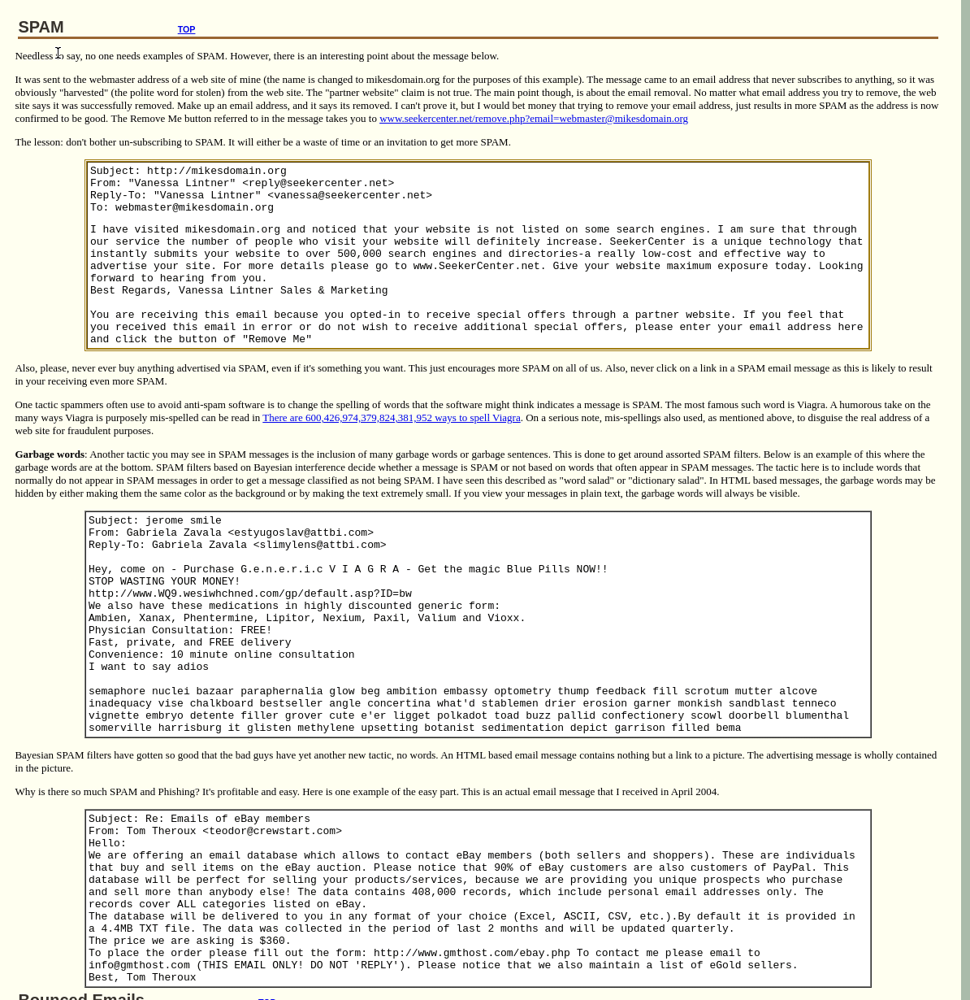

# spam-or-ham
 - Simple ml spam or ham classification with web front-end through api.
 - Purpose was for me to learn how to use a pretrained Tensorflow model through a web API for prediction _without_ using Tensorflow-Serving.

# development stack
 - Python: Flask, Tensorflow/Keras
 - Angular

# Example
